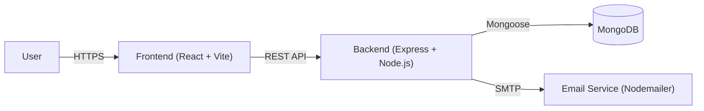

# Architecture Documentation

Technical architecture overview for the **Accessible Language Learning Platform** (LinguaAble).

## 📋 Table of Contents
- [System Overview](#%EF%B8%8F-system-overview)
- [Technology Stack](#%EF%B8%8F-technology-stack)
- [Architecture Diagram](#-architecture-diagram)
- [Component Architecture](#-component-architecture)
- [Data Flow](#-data-flow)
- [Database Design](#%EF%B8%8F-database-design-mongodb)

---

## 🏗️ System Overview

LinguaAble follows a classic **MERN** (MongoDB, Express, React, Node.js) architecture. It is designed as a Single Page Application (SPA) that communicates with a RESTful backend API.

### High-Level Architecture


---

## 🛠️ Technology Stack

### Frontend
| Technology | Purpose |
|------------|---------|
| **React 19** | UI Library |
| **Vite** | Build Tool & Dev Server |
| **Context API** | State Management (Auth, Theme) |
| **Axios** | HTTP Client |
| **CSS Modules** | Component-level Styling |

### Backend
| Technology | Purpose |
|------------|---------|
| **Node.js** | Runtime Environment |
| **Express.js** | Web Framework |
| **Mongoose** | ODM for MongoDB |
| **JWT** | Stateless Authentication |
| **Nodemailer** | Email Notifications |

### Infrastructure
| Service | Purpose |
|---------|---------|
| **MongoDB Atlas** | Cloud Database (or Local MongoDB) |
| **Vercel/Netlify** | Frontend Hosting (Recommended) |
| **Render/Heroku** | Backend Hosting (Recommended) |

---

## 📐 Architecture Diagram

```
┌───────────────────────────────────────────────────────────────┐
│                         Client Layer                           │
│  ┌────────────────────────────────────────────────────────┐  │
│  │  React Application (Port 5173)                         │  │
│  │  ┌─────────┐  ┌──────────┐  ┌──────────┐  ┌────────┐ │  │
│  │  │Dashboard│  │ Learning │  │ AuthPages│  │Settings│ │  │
│  │  └─────────┘  └──────────┘  └──────────┘  └────────┘ │  │
│  │  ┌─────────────────────────────────────────────────┐  │  │
│  │  │     Context API (AuthContext, ThemeContext)     │  │  │
│  │  └─────────────────────────────────────────────────┘  │  │
│  └────────────────────────────────────────────────────────┘  │
└───────────────────────────────────────────────────────────────┘
                            │
                            │ REST API (JSON)
                            │
┌───────────────────────────────────────────────────────────────┐
│                      Application Layer                         │
│  ┌────────────────────────────────────────────────────────┐  │
│  │  Express Server (Port 5000)                            │  │
│  │  ┌─────────┐  ┌──────────┐  ┌──────────┐  ┌────────┐ │  │
│  │  │ Routes  │  │Middleware│  │Controllers│  │ Models │ │  │
│  │  └─────────┘  └──────────┘  └──────────┘  └────────┘ │  │
│  └────────────────────────────────────────────────────────┘  │
└───────────────────────────────────────────────────────────────┘
                            │
                            │ Mongoose Connection
                            │
┌───────────────────────────────────────────────────────────────┐
│                         Data Layer                             │
│  ┌────────────────────────────────────────────────────────┐  │
│  │  MongoDB Database                                      │  │
│  │   - Users Collection (Embeds Progress & History)       │  │
│  │                                                        │  │
│  │                                                        │  │
│  └────────────────────────────────────────────────────────┘  │
└───────────────────────────────────────────────────────────────┘
```

---

## 🧩 Component Architecture

### Frontend Hierarchy
```
App
├── AuthProvider
│   ├── PrivateRoute
│   │   ├── Dashboard
│   │   ├── LearningScreen
│   │   └── Settings (Profile)
│   │
│   ├── PublicRoute
│   │   ├── Login
│   │   └── Signup
│   │
│   │
│   └── Navbar / Sidebar
```

### Key Components
- **AuthContext**: Manages user session state (JWT storage, login/logout functions).
- **PrivateRoute**: Higher Order Component (HOC) that protects routes requiring authentication.
- **LearningScreen**: The core interactive component for lessons, handling speech synthesis (TTS) and input validation.

---

## 🔄 Data Flow

### Authentication Flow (JWT)
1. **User Login**: User submits email/password.
2. **Verification**: Backend validates credentials via `bcryptjs`.
3. **Token Issue**: Server signs a JWT and sends it back with User object.
4. **Storage**: Client stores JWT in `localStorage` and User in Context.
5. **Access**: Client attaches `Authorization: Bearer <token>` to protected requests.

### Lesson Completion Flow
1. **Interaction**: User completes a lesson in `LearningScreen`.
2. **Validation**: Frontend validates the answers locally.
3. **Update**: Frontend sends `PUT /api/auth/update-progress` with updated stats.
4. **Persistence**: Backend updates the `User` document (completedLessons, todayProgress).
5. **Feedback**: UI updates to unlock next lessons or show achievements.

---

## 🗄️ Database Design (MongoDB)

### Users Collection
```javascript
{
  _id: ObjectId,
  username: String,
  email: String,
  password: String, // Hashed
  createdAt: Date,
  // Progress & Gamification Analysis
  completedLessons: [String], // Array of lesson IDs/names
  todayProgress: Number,      // Minutes spent today
  dailyLessonCounts: [        // Activity tracking
    { date: String, count: Number }
  ],
  // Profile & Settings
  preferences: {
    theme: String,
    notifications: Boolean
  },
  loginHistory: [
    { timestamp: Date, device: String }
  ]
}
```

> **Note:** Lesson content is currently managed statically within the frontend (`Lessons.jsx` / `LearningScreen.jsx`) and is not stored in a separate database collection.
