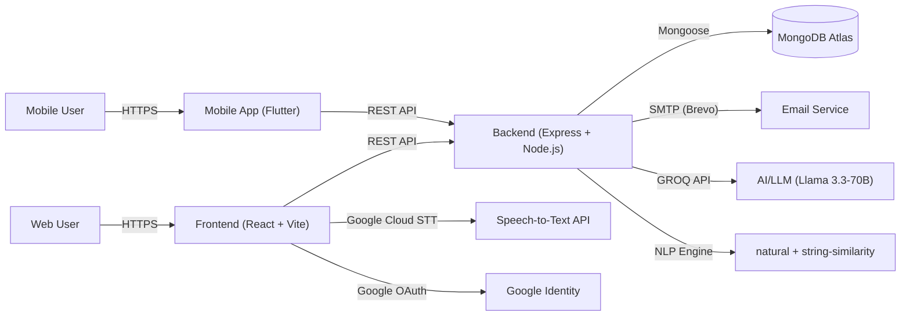

# Architecture Documentation

Technical architecture overview for the **Accessible Language Learning Platform** (LinguaAble).

## 📋 Table of Contents
- [System Overview](#%EF%B8%8F-system-overview)
- [Technology Stack](#%EF%B8%8F-technology-stack)
- [Architecture Diagram](#-architecture-diagram)
- [Component Architecture](#-component-architecture)
- [Data Flow](#-data-flow)
- [Database Design](#%EF%B8%8F-database-design-mongodb)
- [API Architecture](#-api-architecture)
- [External Service Integrations](#-external-service-integrations)

---

## 🏗️ System Overview

LinguaAble follows an extended **MERN** (MongoDB, Express, React, Node.js) architecture with a **Flutter** mobile companion. The system is designed as a multi-client platform: a Single Page Application (SPA) and a Flutter mobile app, both communicating with a shared RESTful backend API. The platform integrates external AI (GROQ), NLP engines, and speech recognition services.

### High-Level Architecture

```mermaid
graph LR
    WebUser[Web User] -- "HTTPS" --> Client["Frontend (React + Vite)"]
    MobileUser[Mobile User] -- "HTTPS" --> Mobile["Mobile App (Flutter)"]
    Client -- "REST API" --> Server["Backend (Express + Node.js)"]
    Mobile -- "REST API" --> Server
    Server -- "Mongoose" --> DB[("MongoDB Atlas")]
    Server -- "SMTP (Brevo)" --> Email["Email Service"]
    Server -- "GROQ API" --> AI["AI/LLM (Llama 3.3-70B)"]
    Server -- "NLP Engine" --> NLP["natural + string-similarity"]
    Client -- "Google Cloud STT" --> STT["Speech-to-Text API"]
    Client -- "Google OAuth" --> OAuth["Google Identity"]
```

---

## 🛠️ Technology Stack

### Frontend
| Technology | Version | Purpose |
|------------|---------|---------|
| **React** | 19.2 | UI Library |
| **Vite** | 7.x | Build Tool & Dev Server |
| **React Router DOM** | 7.x | Client-side Routing |
| **Context API** | — | State Management (UserContext, NotificationContext) |
| **Axios** | 1.x | HTTP Client |
| **Lucide React** | 0.562 | Icon Library |
| **@react-oauth/google** | 0.13 | Google Sign-In |
| **jwt-decode** | 4.x | JWT Token Decoding |
| **Vanilla CSS** | — | Styling with CSS Variables & Theming |

### Backend
| Technology | Version | Purpose |
|------------|---------|---------|
| **Node.js** | 18+ | Runtime Environment |
| **Express.js** | 5.x | Web Framework |
| **Mongoose** | 9.x | ODM for MongoDB |
| **JWT (jsonwebtoken)** | 9.x | Stateless Authentication |
| **Bcryptjs** | 3.x | Password Hashing |
| **Nodemailer** | 7.x | Email via Brevo SMTP |
| **natural** | 6.x | NLP: Double Metaphone, Levenshtein Distance |
| **string-similarity** | 4.x | NLP: Dice/Bigram Similarity |
| **validator** | 13.x | Input Validation |
| **Axios** | 1.x | External API Calls (GROQ) |

### Mobile
| Technology | Purpose |
|------------|---------|
| **Flutter (Dart)** | Cross-platform Mobile App |
| **Android, iOS, Web, Windows, Linux, macOS** | Platform Targets |

### Infrastructure
| Service | Purpose |
|---------|---------|
| **MongoDB Atlas** | Cloud Database |
| **Vercel** | Frontend Hosting |
| **GROQ Cloud** | AI/LLM API (Llama 3.3-70B) |
| **Brevo SMTP** | Transactional Email (OTP) |
| **Google Cloud** | Speech-to-Text API, OAuth 2.0 |

### Testing
| Tool | Where | Purpose |
|------|-------|---------|
| **Jest 30.x** | Backend | Test Runner & Assertions |
| **Supertest 7.x** | Backend | HTTP Endpoint Testing |
| **MongoDB Memory Server** | Backend | In-Memory Database for Tests |
| **Vitest 4.x** | Frontend | Vite-native Test Runner |
| **React Testing Library 16.x** | Frontend | Component Rendering & Interaction |
| **jsdom 28.x** | Frontend | Browser Environment Simulation |
| **ESLint** | Frontend | Static Code Analysis |

---

## 📐 Architecture Diagram

```
┌───────────────────────────────────────────────────────────────┐
│                         Client Layer                           │
│  ┌────────────────────────────────────────────────────────┐  │
│  │  React Application (Port 5173)                         │  │
│  │  ┌─────────┐  ┌──────────┐  ┌──────────┐  ┌────────┐ │  │
│  │  │Dashboard│  │ Learning │  │ AuthPages│  │Settings│ │  │
│  │  └─────────┘  └──────────┘  └──────────┘  └────────┘ │  │
│  │  ┌──────────┐ ┌───────────┐ ┌──────────┐ ┌─────────┐ │  │
│  │  │Leaderboard│ │ Community │ │ Progress │ │ Profile │ │  │
│  │  └──────────┘ └───────────┘ └──────────┘ └─────────┘ │  │
│  │  ┌─────────────────────────────────────────────────┐  │  │
│  │  │   Context API (UserContext, NotificationContext)│  │  │
│  │  └─────────────────────────────────────────────────┘  │  │
│  │  ┌──────────────────┐  ┌────────────────────────────┐ │  │
│  │  │  ChatBot (GROQ)  │  │  AccessibilityWidget       │ │  │
│  │  └──────────────────┘  └────────────────────────────┘ │  │
│  └────────────────────────────────────────────────────────┘  │
│                                                               │
│  ┌────────────────────────────────────────────────────────┐  │
│  │  Flutter Mobile App (Android, iOS, Web, Desktop)       │  │
│  └────────────────────────────────────────────────────────┘  │
└───────────────────────────────────────────────────────────────┘
                            │
                            │ REST API (JSON)
                            │
┌───────────────────────────────────────────────────────────────┐
│                      Application Layer                         │
│  ┌────────────────────────────────────────────────────────┐  │
│  │  Express Server (Port 5000)                            │  │
│  │  ┌──────────────┐  ┌──────────┐  ┌──────────────────┐ │  │
│  │  │ /api/auth     │  │Middleware│  │ /api/ai          │ │  │
│  │  │ Auth, Profile,│  │(JWT      │  │ Daily Plan,      │ │  │
│  │  │ Progress,     │  │ Protect) │  │ Chatbot          │ │  │
│  │  │ Leaderboard,  │  │          │  │ (GROQ API)       │ │  │
│  │  │ Friends,      │  │          │  ├──────────────────┤ │  │
│  │  │ Community,    │  │          │  │ /api/eval        │ │  │
│  │  │ Search        │  │          │  │ NLP Pronunciation│ │  │
│  │  └──────────────┘  └──────────┘  └──────────────────┘ │  │
│  └────────────────────────────────────────────────────────┘  │
└───────────────────────────────────────────────────────────────┘
                            │
                            │ Mongoose Connection
                            │
┌───────────────────────────────────────────────────────────────┐
│                         Data Layer                             │
│  ┌────────────────────────────────────────────────────────┐  │
│  │  MongoDB Atlas                                         │  │
│  │   - Users Collection                                   │  │
│  │     (Profile, Preferences, Progress, Scores,           │  │
│  │      Streaks, Friends, Login History)                   │  │
│  └────────────────────────────────────────────────────────┘  │
└───────────────────────────────────────────────────────────────┘
```

---

## 🧩 Component Architecture

### Frontend Hierarchy
```
App
├── UserProvider (UserContext)
│   └── NotificationProvider (NotificationContext)
│       └── AppContent
│           ├── NotificationToast (global)
│           ├── ColorOverlay (accessibility)
│           │
│           ├── PublicRoutes
│           │   ├── LandingPage
│           │   ├── Login (+ Google OAuth)
│           │   ├── Signup
│           │   ├── ForgotPassword
│           │   └── ResetPassword
│           │
│           ├── FullScreenRoute
│           │   └── LearningScreen (keyed by lesson ID)
│           │       └── → navigates to LearningReport on completion
│           │
│           └── Layout (Sidebar + Content)
│               ├── Dashboard
│               │   ├── DailyStudyPlan (AI-powered)
│               │   └── WeeklyChart
│               ├── Lessons
│               ├── Leaderboard
│               ├── Settings
│               │   └── AccessibilityWidget
│               ├── ProgressReport
│               ├── LearningReport
│               ├── Community
│               │   ├── FriendRequests
│               │   └── FriendsList
│               └── UserProfile (public profiles)
```

### Key Components
- **UserContext**: Manages user session state (JWT storage, login/logout, preferences, progress tracking, streak management). Syncs with backend on mount.
- **NotificationContext**: Self-contained notification system — inactivity reminders, break reminders during study, goal check-ins, milestone alerts. Supports quiet hours and throttle gating.
- **LearningScreen**: The core interactive component for lessons. Handles speech synthesis (TTS), speech recognition (Google Cloud STT), NLP pronunciation evaluation, scoring, and lesson progression. Full-screen layout without sidebar.
- **ChatBot**: AI-powered LinguaBot using GROQ (Llama 3.3-70B). Context-aware — receives student progress, scores, and profile data to provide personalized Hindi learning assistance.
- **AccessibilityWidget**: Real-time accessibility controls — bionic reading, dyslexia font, color overlays, reduce motion, font size adjustment, and Pomodoro timer.

---

## 🔄 Data Flow

### Authentication Flow (JWT)
1. **User Login**: User submits email/password or uses Google OAuth.
2. **Verification**: Backend validates credentials via `bcryptjs`.
3. **Token Issue**: Server signs a JWT (7-day expiry) and returns it with the full User object.
4. **Storage**: Client stores JWT in `localStorage` and User data in Context.
5. **Streak Check**: Backend checks if streak should reset (gap > 1 day from lastStreakDate).
6. **Login History**: Backend appends to login history (capped at 10 entries).
7. **Access**: Client attaches `Authorization: Bearer <token>` to protected requests.

### Lesson Completion Flow
1. **Interaction**: User completes a lesson in `LearningScreen`.
2. **Pronunciation**: Speech is captured via Web Speech API / Google Cloud STT, sent to backend NLP engine for evaluation.
3. **Scoring**: Frontend calculates lesson score (correct answers / total questions).
4. **Report**: User navigates to `LearningReport` to view detailed results.
5. **Update**: Frontend sends `PUT /api/auth/update-progress` with completedLessons, todayProgress, incrementLessonCount, lessonScore, and date.
6. **Streak**: Backend checks if daily goal is met, updates streak accordingly (consecutive days = extend, gap = reset to 1).
7. **Persistence**: Backend updates the `User` document.
8. **Feedback**: Dashboard updates to show new progress, streak, and unlocked lessons.

### AI Recommendation Flow
1. **Daily Plan**: Dashboard calls `POST /api/ai/daily-plan` with user progress data.
2. **Backend Analysis**: Server determines situation (goal met, weak lessons, next lesson, all completed).
3. **GROQ Call**: Backend sends a structured prompt to GROQ (Llama 3.3-70B) with max 120 tokens.
4. **Response**: AI returns personalized 1-2 sentence recommendation.

### Chatbot Flow
1. **User Message**: ChatBot sends `POST /api/ai/chat` with message, history, progress, and profile.
2. **System Prompt**: Backend builds comprehensive context — student profile, progress, weak lessons, next lesson.
3. **GROQ Call**: Full conversation history (last 6 messages) sent to GROQ.
4. **Response**: AI returns context-aware, empathetic response following strict rules about scope and tone.

---

## 🗄️ Database Design (MongoDB)

### Users Collection
```javascript
{
  _id: ObjectId,
  email: String,                    // Required, unique, validated
  username: String,
  fullName: String,
  age: Number,
  gender: String,                   // enum: male, female, other, prefer-not-to-say
  bio: String,                      // max 500 chars
  avatarUrl: String,
  password: String,                 // Hashed (bcryptjs)
  createdAt: Date,

  // Password Reset
  resetPasswordToken: String,       // Hashed OTP (SHA-256)
  resetPasswordExpire: Date,        // 1-minute expiry

  // Preferences (Accessibility-focused)
  preferences: {
    theme: String,                  // 'dark' | 'light'
    soundEffects: Boolean,
    animationReduced: Boolean,
    fontSize: String,               // 'small' | 'medium' | 'large'
    dailyGoalMinutes: Number,       // Default: 5
    dyslexiaFont: Boolean,
    colorOverlay: String            // 'none' | 'yellow' | 'blue' | 'peach' | 'green'
  },

  // Progress Tracking
  completedLessons: [Number],       // Array of lesson IDs (1-45)
  todayProgress: Number,            // Minutes studied today
  progressDate: String,             // Date string for daily reset
  streak: Number,                   // Consecutive days meeting daily goal
  lastStreakDate: String,           // YYYY-MM-DD for streak continuity

  // Charts & Analytics
  dailyLessonCounts: [{
    date: String,                   // YYYY-MM-DD
    count: Number                   // Lessons completed that day
  }],
  dailyScores: [{
    date: String,                   // YYYY-MM-DD
    score: Number                   // Sum of all lesson scores that day
  }],
  lessonScores: [{
    lessonId: Number,
    score: Number,                  // 0-100 percentage
    date: String                    // YYYY-MM-DD
  }],

  // Login History
  loginHistory: [{
    timestamp: Date,
    device: String                  // Default: 'Web Browser'
  }],                               // Capped at 10 entries

  // Friend System
  friends: [ObjectId],              // Ref: User
  friendRequestsReceived: [ObjectId], // Ref: User
  friendRequestsSent: [ObjectId]     // Ref: User
}
```

> **Note:** Lesson content is managed statically within the frontend (`LearningScreen.jsx`) and the backend AI service (`aiRoutes.js` lesson metadata). It is not stored in a database collection.

---

## 🌐 API Architecture

### Route Structure
| Mount Point | File | Purpose |
|-------------|------|---------|
| `/api/auth` | `authRoutes.js` | Authentication, profile, progress, leaderboard, friends, community |
| `/api/ai` | `aiRoutes.js` | AI daily plan, chatbot |
| `/api/eval` | `nlpEvalRoutes.js` | NLP pronunciation evaluation |

### CORS Policy
- Allows any `localhost` port (for Vite, Flutter web, etc.)
- Allows production URL: `https://linguaable.vercel.app`
- Supports credentials and all standard HTTP methods

---

## 🔌 External Service Integrations

### GROQ (AI/LLM)
- **Model**: `llama-3.3-70b-versatile`
- **Used For**: Daily study plan generation, LinguaBot chatbot
- **Temperature**: 0.5 (daily plan), 0.6 (chatbot)
- **Max Tokens**: 120 (daily plan), 200 (chatbot)

### Brevo SMTP (Email)
- **Used For**: Password reset OTP emails
- **Protocol**: SMTP over SSL (port 465)
- **Host**: `smtp-relay.brevo.com`

### Google Cloud
- **Speech-to-Text**: Real-time pronunciation capture in LearningScreen
- **OAuth 2.0**: Google Sign-In for authentication

### NLP Engine (Backend)
- **Double Metaphone**: Phonetic algorithm for romanized Hindi matching
- **Levenshtein Distance**: Fuzzy string matching (≥75% threshold)
- **Dice/Bigram Similarity**: String similarity (≥70% threshold)
- **Hindi Transliteration**: Hindi script → Roman transliteration lookup table
- **Phonetic Normalization**: Vowel deduplication, consonant cluster simplification
